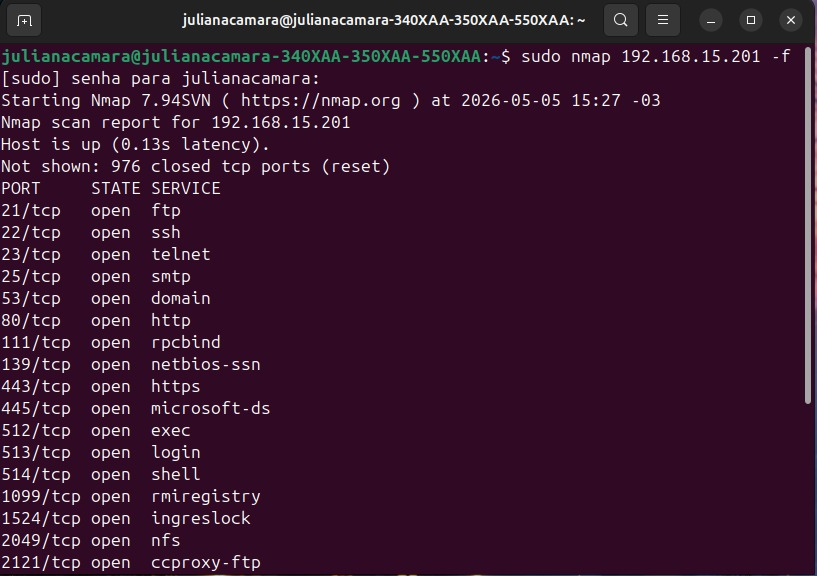
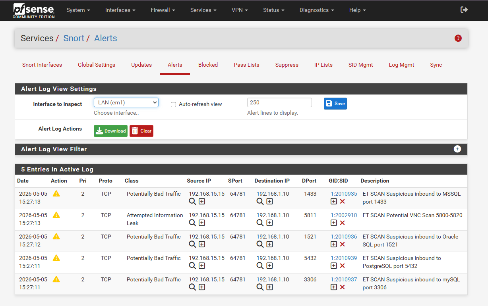
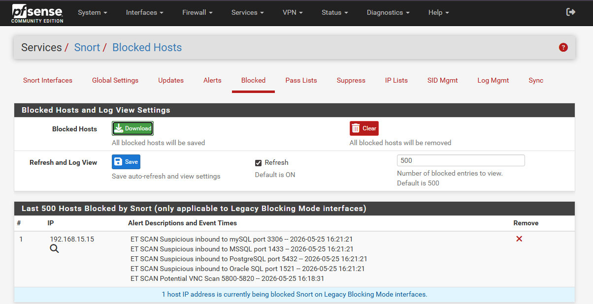
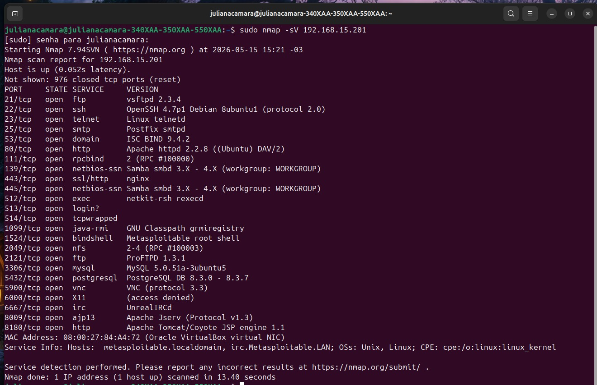
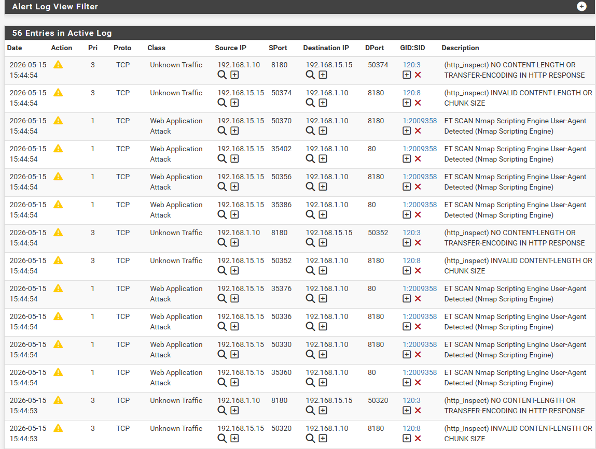

# Sistema_IDS-IPS_Utilizando_Snort_Integrado_ao_PfSense

# 🛡️ Implementação e Avaliação de um Sistema IDS/IPS Baseado em Snort e pfSense para Redes Corporativas

> Projeto desenvolvido como Trabalho de Conclusão de Curso (TCC) do Bacharelado em Ciência da Computação da Universidade Federal do Maranhão (UFMA).

Este projeto apresenta a implementação de um ambiente de segurança de redes utilizando **pfSense** e **Snort** para detectar e prevenir ataques direcionados a serviços de rede e aplicações web.

O ambiente foi construído em um laboratório virtual composto por um firewall pfSense, uma máquina vulnerável Metasploitable2 e uma máquina física atacante Ubuntu. Foram simulados diferentes cenários de ataque para validar a capacidade do sistema em detectar e bloquear atividades maliciosas, incluindo varreduras de rede, identificação de serviços, detecção de sistema operacional, ataques de Path Traversal e Cross-Site Scripting (XSS).

Além da implementação do ambiente, o projeto apresenta a configuração das regras do Snort, a análise dos alertas gerados e uma avaliação da eficiência do sistema como solução IDS/IPS para redes corporativas.

# 📖 Visão Geral

## 🎯 Motivação

O desenvolvimento deste projeto foi motivado pelo crescimento expressivo dos ataques cibernéticos direcionados às organizações, especialmente às pequenas e médias empresas, que muitas vezes possuem recursos financeiros e equipes reduzidas para investir em soluções robustas de segurança da informação.

Nesse contexto, a implementação de sistemas de detecção e prevenção de intrusões (**IDS/IPS**) representa uma alternativa eficiente para aumentar a visibilidade sobre o tráfego da rede, identificar atividades maliciosas e reduzir a superfície de ataque dos ambientes corporativos.

---

## 🖥️ Ambiente de Testes

Para validar a solução proposta, foi desenvolvido um ambiente de testes totalmente isolado utilizando o **Oracle VirtualBox**.

O laboratório é composto por três máquinas, cada uma desempenhando uma função específica:

- 🛡️ **pfSense + Snort:** responsável pelo roteamento do tráfego da rede, aplicação das políticas de firewall e execução do Snort como sistema IDS/IPS.
- 🎯 **Metasploitable2:** máquina vulnerável utilizada como alvo dos ataques simulados.
- 💻 **Ubuntu (máquina física):** utilizada como máquina atacante para executar testes controlados e validar a capacidade de detecção e bloqueio do ambiente.

O **pfSense** é um firewall e roteador *open source* baseado em **FreeBSD**, amplamente utilizado em ambientes corporativos devido à sua flexibilidade e ao suporte para diversos pacotes de segurança. Neste projeto, foi utilizado como plataforma principal para instalação e gerenciamento do **Snort**, integrado nativamente por meio do gerenciador de pacotes do próprio sistema.

Como alvo dos testes, foi utilizada a distribuição **Metasploitable2**, um sistema Linux propositalmente vulnerável e amplamente empregado em laboratórios de segurança e testes de intrusão.

---

## 🌐 Arquitetura da Rede
---

Para garantir que todo o tráfego fosse analisado pelo sistema de detecção de intrusões, a máquina **Metasploitable2** foi configurada para utilizar o **pfSense** como gateway padrão. Dessa forma, a máquina vulnerável não era exposta diretamente à Internet, fazendo com que toda comunicação entre a máquina atacante e o servidor passasse obrigatoriamente pelo firewall, permitindo ao **Snort** inspecionar os pacotes e aplicar suas regras de detecção e prevenção.

A máquina virtual do **pfSense** foi configurada com duas interfaces de rede:

- **WAN (Bridge):** conectada à rede física por meio do modo **Bridge**, recebendo um endereço IP diretamente do roteador e simulando a conexão com a Internet.
- **LAN (Internal Network):** configurada como uma rede interna denominada **Rede_TCC**, utilizada para comunicação entre o **pfSense** e a máquina **Metasploitable2**.

Essa arquitetura permitiu reproduzir um cenário semelhante ao encontrado em redes corporativas, no qual o firewall atua como ponto central de inspeção e controle do tráfego entre redes externas e internas.

> **A figura abaixo apresenta a arquitetura de rede utilizada durante o desenvolvimento e a validação deste projeto.**

.png)
---

## Testes Realizados e Regras Monitoradas no Snort
---

Para a realização dos testes, eu utilizei as ferramentas **Nmap** e **Curl** no Ubuntu. De acordo com o framework **Mitre Att&ck**, uma das táticas utilizadas por agentes mal-intencionados é o "Reconhecimento"[Reconnaissance - TA0043] em que eles buscam informações sobre a redes, os sistemas utilizados pelas empresas, dentre outras, para planejarem futuros ataques. 

Assim, umas das técnicas usadas pelos adversários é o *Active Scanning*[T1595] que eu simulei usando o Nmap. O Nmap é uma ferramenta de código aberto usada tanto por administradores de rede e profissionais de cibersegurança quanto por agentes mal-intencionados para verificar o status da rede e também auditorias de segurança, que fornece vários tipos de varreduras de rede para diferentes propósitos como a verificação de quais hosts estão disponíveis, quais serviços e protocolos eles usam, qual sistema operacional os hosts utilizam, dentre outras informações importantes para um bom diagnóstico de rede.

### Primeiro Teste 
--- 

O primeiro teste foi uma varredura genérica, utilizando o parâmetro *-f* para fragmentar os pacotes IP transmitidos durante a comunicação. Esse parâmetro foi utilizado pois é uma das técnicas para impedir que sistemas IDS/IPS como o Snort consigam identificar a varredura. Na imagem  está a execução desse comando. 

No Snort, foram acionadas apenas as regras relacionadas com os testes realizados para evitar o acúmulo de falsos positivos. Nesse contexto, as regras acionadas para esse teste foram: 

- emerging-scan.rules
- snort_indicator-scan-rules

Durante os testes verificou-se que o Snort conseguiu detectar e bloquear a simulação de um Nmap com pacotes fragmentados, o que demonstrou a eficiência dessa ferramenta e seu potencial para proteger redes corporativas. A seguir, temos o print da detecção e o bloqueio da máquina Ubuntu  

### Segundo teste
---

O segundo teste consistiu de uma varredura para descoberta de versões de serviços utilizando o parâmetro do Nmap *-sV*.Esse tipo de escaneamento permite identificar não apenas as portas abertas em um host, mas também as versões dos serviços em execução, fornecendo informações que podem auxiliar na identificação de vulnerabilidades conhecidas associadas a versões específicas de softwares.

Na imagem  está a execução do comando na máquina Ubuntu.

No Snort, essa varredura também foi detectada, o que demonstra o quanto as regras dessa ferramenta foram bem definidas e conseguem detectar diferentes variações de um escaneamento da rede.Na imagem a seguir, temos o print da detecção pelo Snort:

---

 
